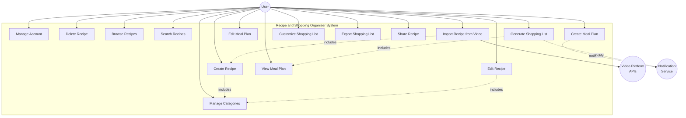
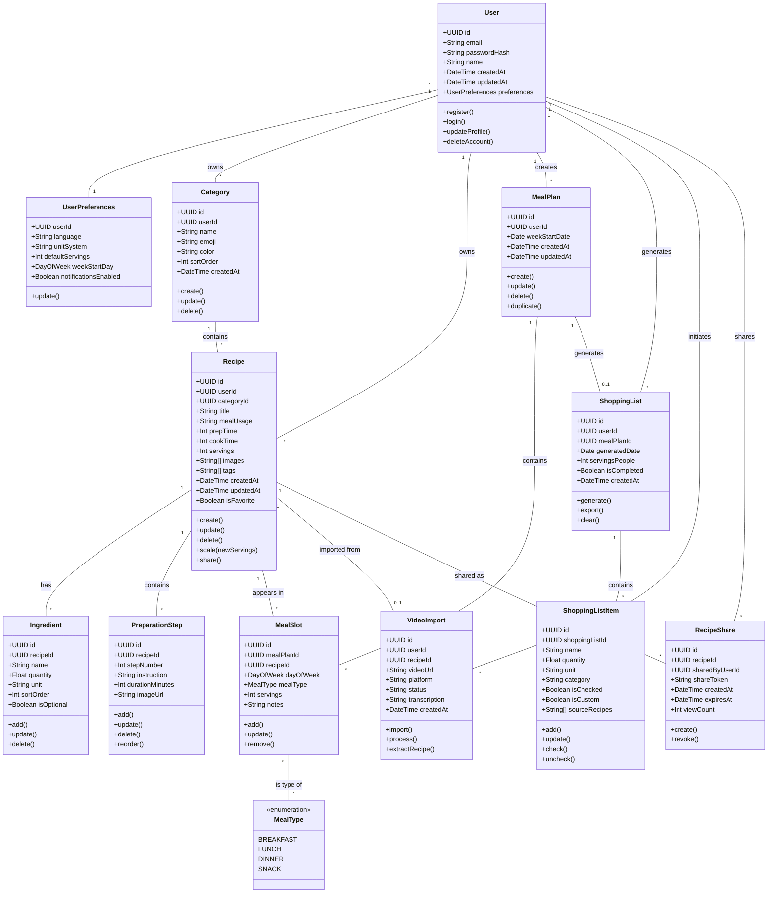
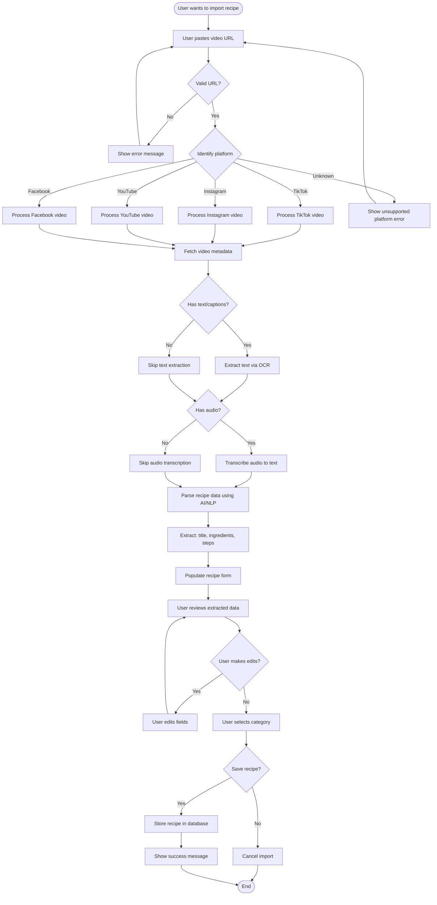
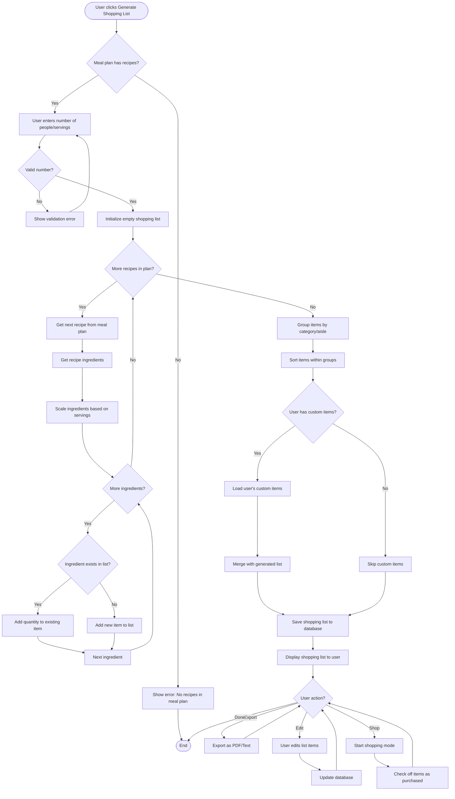
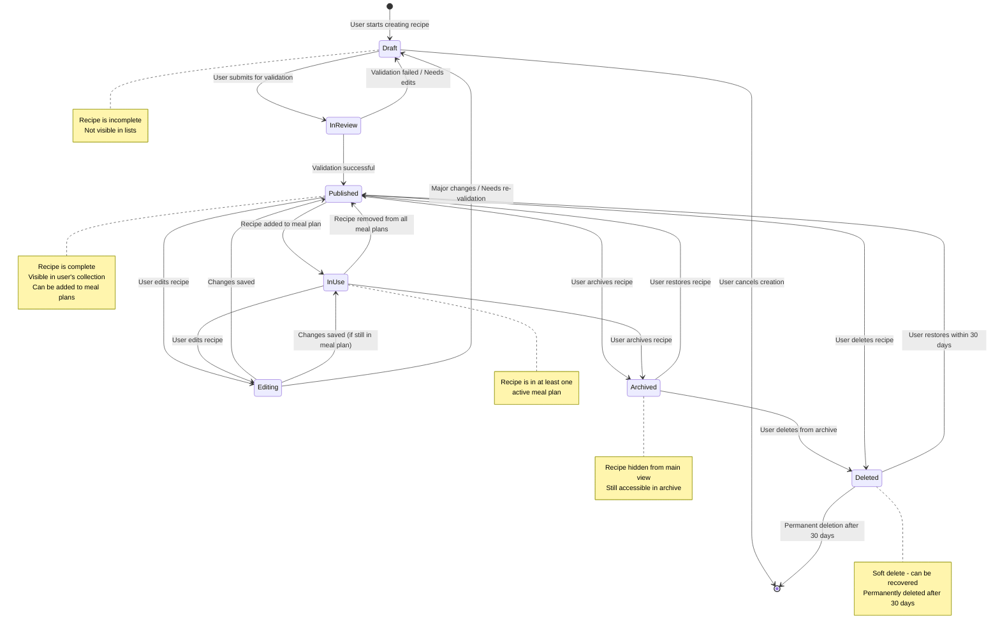
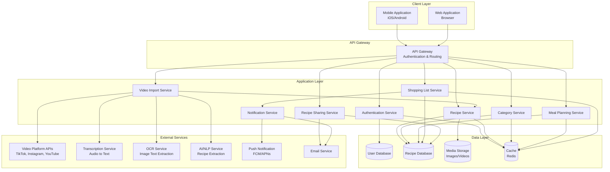
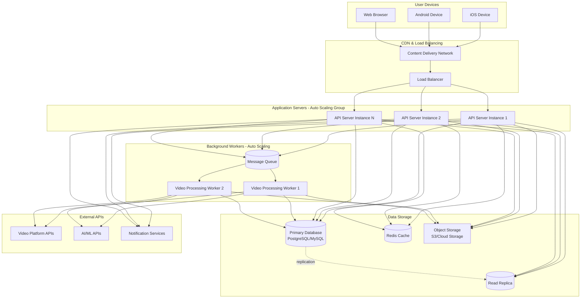

# UML Diagrams

## 1. Use Case Diagram

### 1.1 Overview
This diagram illustrates the main interactions between users and the Recipe and Shopping Organizer system.

### 1.2 Mermaid Diagram

### 1.3 Use Case Descriptions

#### UC1: Manage Account
- **Actor**: User
- **Description**: User registers, logs in, updates profile, manages preferences
- **Preconditions**: None for registration; account exists for other operations
- **Postconditions**: User account created/updated

#### UC2: Create Recipe
- **Actor**: User
- **Description**: User creates a new recipe with details, ingredients, and steps
- **Preconditions**: User is authenticated
- **Postconditions**: Recipe is saved in user's collection
- **Includes**: Manage Categories (optional)

#### UC3: Edit Recipe
- **Actor**: User
- **Description**: User modifies existing recipe information
- **Preconditions**: Recipe exists, user owns the recipe
- **Postconditions**: Recipe changes are saved

#### UC4: Delete Recipe
- **Actor**: User
- **Description**: User removes a recipe from their collection
- **Preconditions**: Recipe exists, user owns the recipe
- **Postconditions**: Recipe is moved to trash/deleted

#### UC5: Browse Recipes
- **Actor**: User
- **Description**: User views recipes by category or all recipes
- **Preconditions**: User is authenticated
- **Postconditions**: Recipes are displayed

#### UC6: Search Recipes
- **Actor**: User
- **Description**: User searches for recipes by keywords, ingredients, or tags
- **Preconditions**: User is authenticated
- **Postconditions**: Matching recipes are displayed

#### UC7: Manage Categories
- **Actor**: User
- **Description**: User creates, edits, or deletes recipe categories
- **Preconditions**: User is authenticated
- **Postconditions**: Categories are updated

#### UC8: Import Recipe from Video
- **Actor**: User
- **External System**: Video Platform APIs
- **Description**: User imports recipe by pasting video URL from social media
- **Preconditions**: User has valid video URL, platform API is accessible
- **Postconditions**: Recipe is extracted and saved

#### UC9: Create Meal Plan
- **Actor**: User
- **Description**: User assigns recipes to specific days and meal slots for the week
- **Preconditions**: User has recipes in collection
- **Postconditions**: Meal plan is saved

#### UC10: Edit Meal Plan
- **Actor**: User
- **Description**: User modifies existing meal plan entries
- **Preconditions**: Meal plan exists
- **Postconditions**: Meal plan changes are saved

#### UC11: View Meal Plan
- **Actor**: User
- **Description**: User views current or past meal plans
- **Preconditions**: User is authenticated
- **Postconditions**: Meal plan is displayed

#### UC12: Generate Shopping List
- **Actor**: User
- **Description**: System generates grocery list from weekly meal plan
- **Preconditions**: Meal plan exists with recipes
- **Postconditions**: Shopping list is created

#### UC13: Customize Shopping List
- **Actor**: User
- **Description**: User adds, removes, or edits items in shopping list
- **Preconditions**: Shopping list exists
- **Postconditions**: Shopping list is updated

#### UC14: Export Shopping List
- **Actor**: User
- **Description**: User exports shopping list as PDF, text, or shares it
- **Preconditions**: Shopping list exists
- **Postconditions**: List is exported/shared

#### UC15: Share Recipe
- **Actor**: User
- **Description**: User shares recipe with others via link or export
- **Preconditions**: Recipe exists
- **Postconditions**: Recipe is shared

## 2. Class Diagram

### 2.1 Overview
This diagram shows the main domain entities and their relationships.

### 2.2 Mermaid Diagram

### 2.3 Key Relationships

- **User to Recipe**: One-to-Many (A user owns multiple recipes)
- **User to Category**: One-to-Many (A user creates multiple categories)
- **Category to Recipe**: One-to-Many (A category contains multiple recipes)
- **Recipe to Ingredient**: One-to-Many (A recipe has multiple ingredients)
- **Recipe to PreparationStep**: One-to-Many (A recipe has multiple steps)
- **User to MealPlan**: One-to-Many (A user creates multiple meal plans)
- **MealPlan to MealSlot**: One-to-Many (A meal plan has multiple meal slots)
- **Recipe to MealSlot**: One-to-Many (A recipe can appear in multiple meal slots)
- **MealPlan to ShoppingList**: One-to-One or One-to-Zero (A meal plan generates one shopping list)
- **ShoppingList to ShoppingListItem**: One-to-Many (A shopping list has multiple items)

## 3. Activity Diagram: Import Recipe from Video

### 3.1 Overview
This activity diagram shows the flow of importing a recipe from a video URL.

### 3.2 Mermaid Diagram

## 4. Activity Diagram: Generate Shopping List

### 4.1 Overview
This activity diagram shows the process of generating a shopping list from a meal plan.

### 4.2 Mermaid Diagram

## 5. State Diagram: Recipe Lifecycle

### 5.1 Overview
This state diagram shows the different states a recipe can be in throughout its lifecycle.

### 5.2 Mermaid Diagram

## 6. Component Diagram

### 6.1 Overview
This diagram shows the high-level components of the system and their interactions.

### 6.2 Mermaid Diagram

### 6.3 Component Descriptions

#### Client Layer
- **Mobile Application**: Native iOS/Android app built with chosen framework
- **Web Application**: Responsive web interface for desktop/tablet access

#### API Gateway
- Routes requests to appropriate services
- Handles authentication and authorization
- Implements rate limiting and request validation
- Provides API versioning

#### Application Layer Services
- **Authentication Service**: User registration, login, session management
- **Recipe Service**: CRUD operations for recipes, search, filtering
- **Category Service**: Category management operations
- **Meal Planning Service**: Meal plan creation and management
- **Shopping Service**: Shopping list generation and management
- **Video Import Service**: Orchestrates video import workflow
- **Notification Service**: Sends push notifications and emails
- **Recipe Sharing Service**: Handles recipe sharing and public links

#### Data Layer
- **User Database**: Stores user accounts, preferences, authentication data
- **Recipe Database**: Stores recipes, categories, meal plans, shopping lists
- **Media Storage**: Object storage for images and video thumbnails
- **Cache**: Redis cache for frequently accessed data, session storage

#### External Services
- **Video Platform APIs**: TikTok, Instagram, YouTube, Facebook APIs
- **Transcription Service**: Converts video audio to text
- **OCR Service**: Extracts text from video frames
- **AI/NLP Service**: Parses and extracts recipe data from text
- **Push Notification Service**: Firebase Cloud Messaging, Apple Push Notifications
- **Email Service**: Transactional email delivery

## 7. Deployment Diagram

### 7.1 Overview
This diagram shows a potential cloud-based deployment architecture.

### 7.2 Mermaid Diagram

### 7.3 Deployment Notes

- **Auto-scaling**: Application servers and workers scale based on load
- **High Availability**: Multiple instances with load balancing
- **Database Replication**: Read replicas for read-heavy operations
- **Caching Strategy**: Redis for session data, frequently accessed recipes
- **CDN**: Static assets and media files served via CDN
- **Message Queue**: Asynchronous processing of video imports
- **Monitoring**: Application performance monitoring, logging, alerts
