# Sequence Diagrams

## 📋 Diagram Versions Guide

This document contains sequence diagrams for all major flows. Each diagram is provided in a **simplified MVP version** that shows the straightforward implementation without caching, gateways, or service layers.

### How to Read These Diagrams

**For MVP Development (Phase 1 - Weeks 1-8):**
- ✅ Use the **"MVP Simplified"** versions
- ✅ Follow the direct `App → API → Database` pattern
- ✅ Ignore any references to Gateway, Cache, or separate services

**For Future Scaling (Phase 3):**
- Some diagrams include complex versions in collapsible sections
- These show how to add caching and service layers later
- Don't implement these unless you have performance issues

**Phase 2 (Video/AI):**
- Video Import section is marked as "PHASE 2 ONLY"
- Only implement after core recipe app is working

---

## MVP Architecture Pattern

All MVP diagrams follow this simple pattern:

```
Mobile App → Backend API → PostgreSQL Database
              ↓
     Image Storage (Cloudinary)
```

**No intermediary layers, no complexity.**

---

> **Note**: These diagrams show the detailed interaction flows. For MVP (Phase 1), ignore Gateway and Cache components - use direct API calls. Gateway and caching are for Phase 3 scaling.

## 1. User Authentication Flow

### 1.1 User Login Sequence (MVP Simplified)

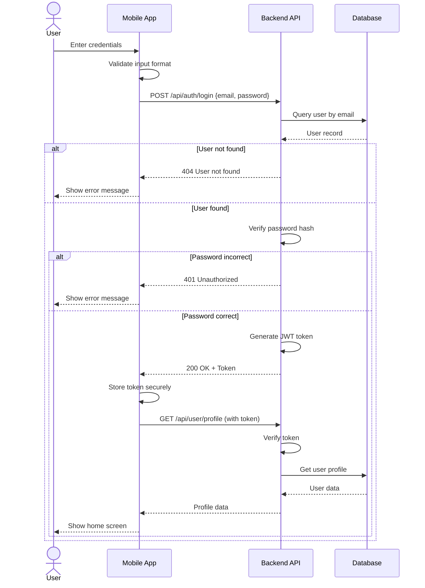
```mermaid
sequenceDiagram
    actor User
    participant App as Mobile App
    participant API as Backend API
    participant DB as Database
    
    User->>App: Enter credentials
    App->>App: Validate input format
    App->>API: POST /api/auth/login {email, password}
    API->>DB: Query user by email
    DB-->>API: User record
    
    alt User not found
        API-->>App: 404 User not found
        App-->>User: Show error message
    else User found
        API->>API: Verify password hash
        
        alt Password incorrect
            API-->>App: 401 Unauthorized
            App-->>User: Show error message
        else Password correct
            API->>API: Generate JWT token
            API-->>App: 200 OK + Token
            App->>App: Store token securely
            App->>API: GET /api/user/profile (with token)
            API->>API: Verify token
            API->>DB: Get user profile
            DB-->>API: User data
            API-->>App: Profile data
            App-->>User: Show home screen
        end
    end
```

### 1.2 User Login Sequence (Future with Caching - Phase 3)

<details>
<summary>Click to see Phase 3 version with Gateway and Cache</summary>

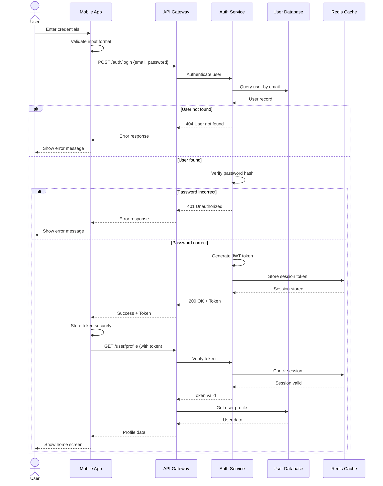
```mermaid
sequenceDiagram
    actor User
    participant App as Mobile App
    participant Gateway as API Gateway
    participant Auth as Auth Service
    participant DB as User Database
    participant Cache as Redis Cache
    
    User->>App: Enter credentials
    App->>App: Validate input format
    App->>Gateway: POST /auth/login {email, password}
    Gateway->>Auth: Authenticate user
    Auth->>DB: Query user by email
    DB-->>Auth: User record
    
    alt User not found
        Auth-->>Gateway: 404 User not found
        Gateway-->>App: Error response
        App-->>User: Show error message
    else User found
        Auth->>Auth: Verify password hash
        
        alt Password incorrect
            Auth-->>Gateway: 401 Unauthorized
            Gateway-->>App: Error response
            App-->>User: Show error message
        else Password correct
            Auth->>Auth: Generate JWT token
            Auth->>Cache: Store session token
            Cache-->>Auth: Session stored
            Auth-->>Gateway: 200 OK + Token
            Gateway-->>App: Success + Token
            App->>App: Store token securely
            App->>Gateway: GET /user/profile (with token)
            Gateway->>Auth: Verify token
            Auth->>Cache: Check session
            Cache-->>Auth: Session valid
            Auth-->>Gateway: Token valid
            Gateway->>DB: Get user profile
            DB-->>Gateway: User data
            Gateway-->>App: Profile data
            App-->>User: Show home screen
        end
    end
```

</details>

## 2. Create Recipe Flow

### 2.1 Manual Recipe Creation Sequence (MVP Simplified)

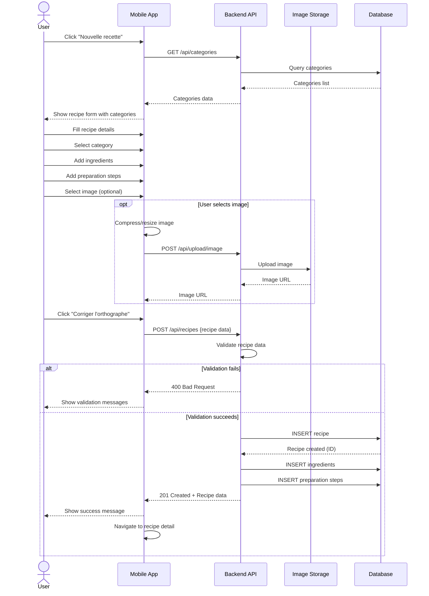
```mermaid
sequenceDiagram
    actor User
    participant App as Mobile App
    participant API as Backend API
    participant Storage as Image Storage
    participant DB as Database
    
    User->>App: Click "Nouvelle recette"
    App->>API: GET /api/categories
    API->>DB: Query categories
    DB-->>API: Categories list
    API-->>App: Categories data
    App-->>User: Show recipe form with categories
    
    User->>App: Fill recipe details
    User->>App: Select category
    User->>App: Add ingredients
    User->>App: Add preparation steps
    User->>App: Select image (optional)
    
    opt User selects image
        App->>App: Compress/resize image
        App->>API: POST /api/upload/image
        API->>Storage: Upload image
        Storage-->>API: Image URL
        API-->>App: Image URL
    end
    
    User->>App: Click "Corriger l'orthographe"
    App->>API: POST /api/recipes {recipe data}
    API->>API: Validate recipe data
    
    alt Validation fails
        API-->>App: 400 Bad Request
        App-->>User: Show validation messages
    else Validation succeeds
        API->>DB: INSERT recipe
        DB-->>API: Recipe created (ID)
        API->>DB: INSERT ingredients
        API->>DB: INSERT preparation steps
        API-->>App: 201 Created + Recipe data
        App-->>User: Show success message
        App->>App: Navigate to recipe detail
    end
```

### 2.2 Manual Recipe Creation (Future with Caching - Phase 3)

<details>
<summary>Click to see Phase 3 version with Gateway and Cache</summary>

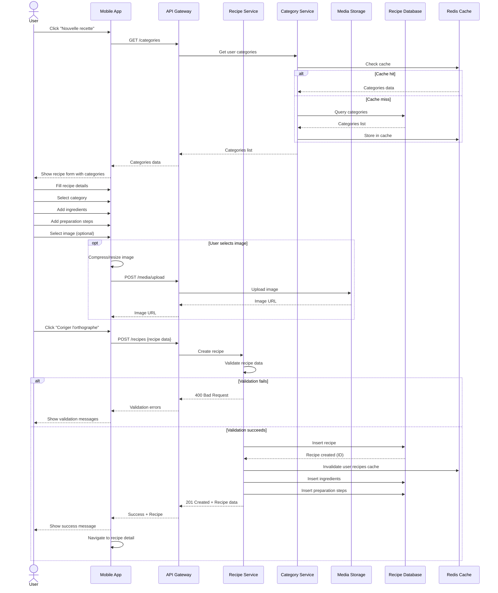
```mermaid
sequenceDiagram
    actor User
    participant App as Mobile App
    participant Gateway as API Gateway
    participant Recipe as Recipe Service
    participant Category as Category Service
    participant Storage as Media Storage
    participant DB as Recipe Database
    participant Cache as Redis Cache
    
    User->>App: Click "Nouvelle recette"
    App->>Gateway: GET /categories
    Gateway->>Category: Get user categories
    Category->>Cache: Check cache
    
    alt Cache hit
        Cache-->>Category: Categories data
    else Cache miss
        Category->>DB: Query categories
        DB-->>Category: Categories list
        Category->>Cache: Store in cache
    end
    
    Category-->>Gateway: Categories list
    Gateway-->>App: Categories data
    App-->>User: Show recipe form with categories
    
    User->>App: Fill recipe details
    User->>App: Select category
    User->>App: Add ingredients
    User->>App: Add preparation steps
    User->>App: Select image (optional)
    
    opt User selects image
        App->>App: Compress/resize image
        App->>Gateway: POST /media/upload
        Gateway->>Storage: Upload image
        Storage-->>Gateway: Image URL
        Gateway-->>App: Image URL
    end
    
    User->>App: Click "Coriger l'orthographe"
    App->>Gateway: POST /recipes {recipe data}
    Gateway->>Recipe: Create recipe
    Recipe->>Recipe: Validate recipe data
    
    alt Validation fails
        Recipe-->>Gateway: 400 Bad Request
        Gateway-->>App: Validation errors
        App-->>User: Show validation messages
    else Validation succeeds
        Recipe->>DB: Insert recipe
        DB-->>Recipe: Recipe created (ID)
        Recipe->>Cache: Invalidate user recipes cache
        Recipe->>DB: Insert ingredients
        Recipe->>DB: Insert preparation steps
        Recipe-->>Gateway: 201 Created + Recipe data
        Gateway-->>App: Success + Recipe
        App-->>User: Show success message
        App->>App: Navigate to recipe detail
    end
```

</details>

## 3. Import Recipe from Video Flow - **PHASE 2 ONLY** ⚠️

> **⚠️ Important**: This feature is NOT in Phase 1 MVP. Implement this only in Phase 2 (weeks 9-12) after the core recipe app is working.

### 3.1 Video Import Sequence (Phase 2)

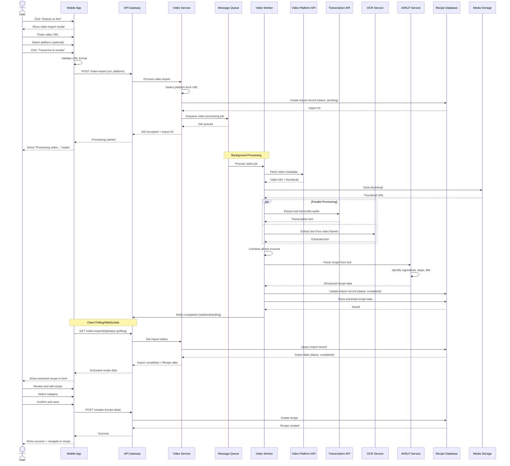
```mermaid
sequenceDiagram
    actor User
    participant App as Mobile App
    participant Gateway as API Gateway
    participant Video as Video Service
    participant Queue as Message Queue
    participant Worker as Video Worker
    participant VideoAPI as Video Platform API
    participant Transcribe as Transcription API
    participant OCR as OCR Service
    participant AI as AI/NLP Service
    participant DB as Recipe Database
    participant Storage as Media Storage
    
    User->>App: Click "Depuis un lien"
    App-->>User: Show video import modal
    User->>App: Paste video URL
    User->>App: Select platform (optional)
    User->>App: Click "Transcrire la recette"
    
    App->>App: Validate URL format
    App->>Gateway: POST /video-import {url, platform}
    Gateway->>Video: Process video import
    Video->>Video: Detect platform from URL
    Video->>DB: Create import record (status: pending)
    DB-->>Video: Import ID
    Video->>Queue: Enqueue video processing job
    Queue-->>Video: Job queued
    Video-->>Gateway: 202 Accepted + Import ID
    Gateway-->>App: Processing started
    App-->>User: Show "Processing video..." loader
    
    Note over Worker,Queue: Background Processing
    Queue->>Worker: Process video job
    Worker->>VideoAPI: Fetch video metadata
    VideoAPI-->>Worker: Video info + thumbnail
    
    Worker->>Storage: Save thumbnail
    Storage-->>Worker: Thumbnail URL
    
    par Parallel Processing
        Worker->>Transcribe: Extract and transcribe audio
        Transcribe-->>Worker: Transcription text
    and
        Worker->>OCR: Extract text from video frames
        OCR-->>Worker: Extracted text
    end
    
    Worker->>Worker: Combine all text sources
    Worker->>AI: Parse recipe from text
    AI->>AI: Identify ingredients, steps, title
    AI-->>Worker: Structured recipe data
    
    Worker->>DB: Update import record (status: completed)
    Worker->>DB: Store extracted recipe data
    DB-->>Worker: Saved
    
    Worker->>Gateway: Notify completion (webhook/polling)
    
    Note over App,Gateway: Client Polling/WebSocket
    App->>Gateway: GET /video-import/{id}/status (polling)
    Gateway->>Video: Get import status
    Video->>DB: Query import record
    DB-->>Video: Import data (status: completed)
    Video-->>Gateway: Import completed + Recipe data
    Gateway-->>App: Extracted recipe data
    
    App-->>User: Show extracted recipe in form
    User->>App: Review and edit recipe
    User->>App: Select category
    User->>App: Confirm and save
    App->>Gateway: POST /recipes {recipe data}
    Gateway->>DB: Create recipe
    DB-->>Gateway: Recipe created
    Gateway-->>App: Success
    App-->>User: Show success + navigate to recipe
```

## 4. Meal Planning Flow

### 4.1 Add Recipe to Meal Plan Sequence (MVP Simplified)

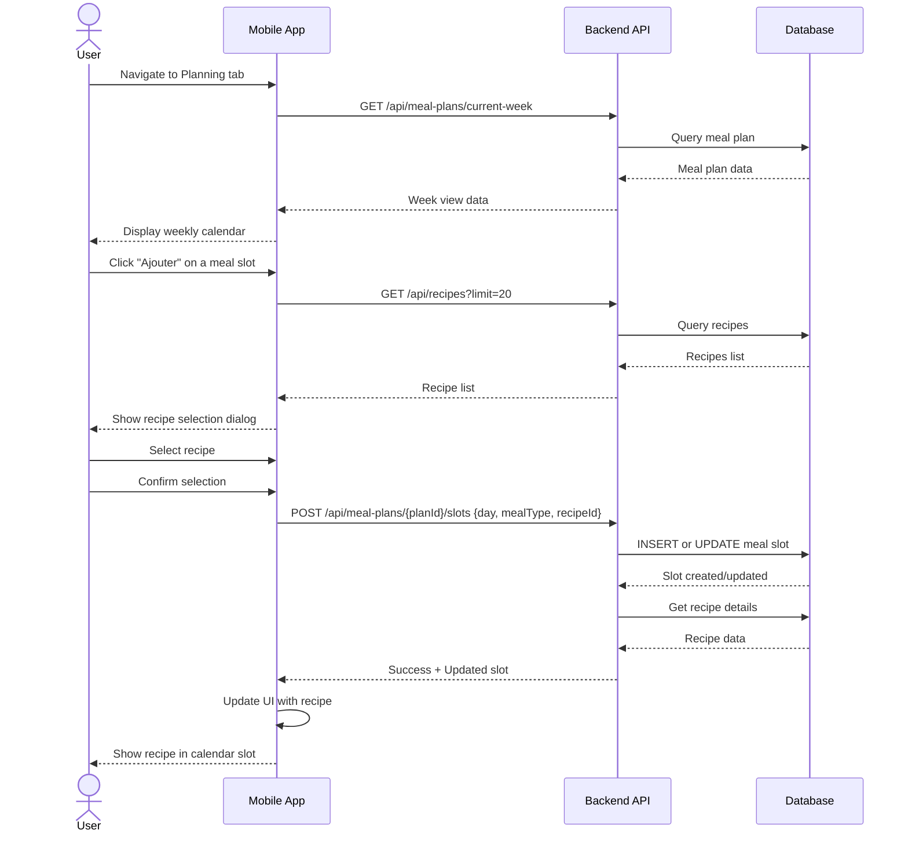
```mermaid
sequenceDiagram
    actor User
    participant App as Mobile App
    participant API as Backend API
    participant DB as Database
    
    User->>App: Navigate to Planning tab
    App->>API: GET /api/meal-plans/current-week
    API->>DB: Query meal plan
    DB-->>API: Meal plan data
    API-->>App: Week view data
    App-->>User: Display weekly calendar
    
    User->>App: Click "Ajouter" on a meal slot
    App->>API: GET /api/recipes?limit=20
    API->>DB: Query recipes
    DB-->>API: Recipes list
    API-->>App: Recipe list
    App-->>User: Show recipe selection dialog
    
    User->>App: Select recipe
    User->>App: Confirm selection
    
    App->>API: POST /api/meal-plans/{planId}/slots {day, mealType, recipeId}
    API->>DB: INSERT or UPDATE meal slot
    DB-->>API: Slot created/updated
    API->>DB: Get recipe details
    DB-->>API: Recipe data
    API-->>App: Success + Updated slot
    App->>App: Update UI with recipe
    App-->>User: Show recipe in calendar slot
```

### 4.2 View Recipe Details from Meal Plan (MVP Simplified)

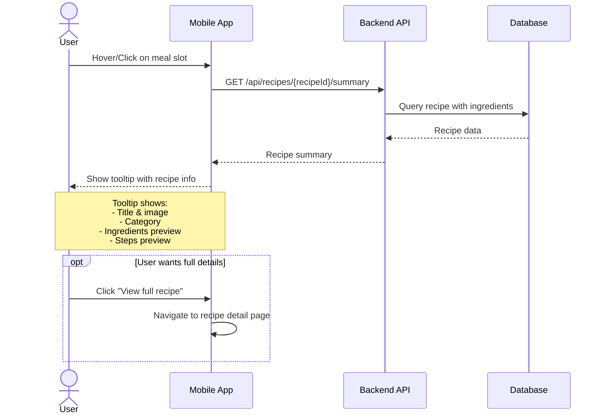
```mermaid
sequenceDiagram
    actor User
    participant App as Mobile App
    participant API as Backend API
    participant DB as Database
    
    User->>App: Hover/Click on meal slot
    App->>API: GET /api/recipes/{recipeId}/summary
    API->>DB: Query recipe with ingredients
    DB-->>API: Recipe data
    API-->>App: Recipe summary
    App-->>User: Show tooltip with recipe info
    
    Note over User,App: Tooltip shows:<br/>- Title & image<br/>- Category<br/>- Ingredients preview<br/>- Steps preview
    
    opt User wants full details
        User->>App: Click "View full recipe"
        App->>App: Navigate to recipe detail page
    end
```

## 5. Generate Shopping List Flow

### 5.1 Shopping List Generation Sequence (MVP Simplified)

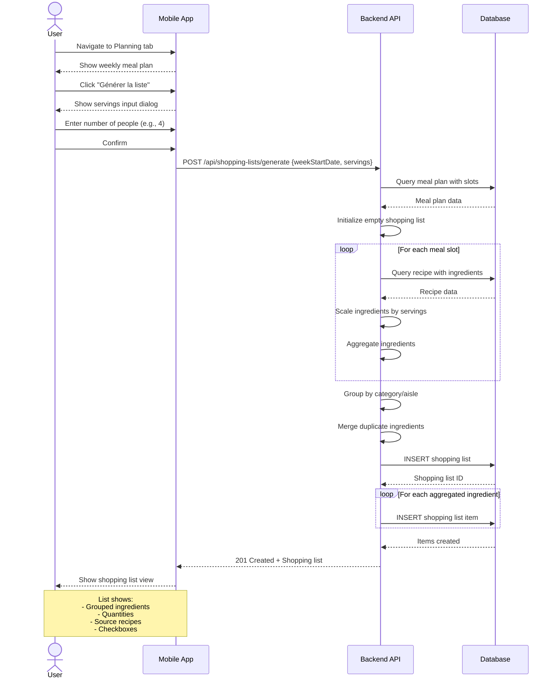
```mermaid
sequenceDiagram
    actor User
    participant App as Mobile App
    participant API as Backend API
    participant DB as Database
    
    User->>App: Navigate to Planning tab
    App-->>User: Show weekly meal plan
    User->>App: Click "Générer la liste"
    App-->>User: Show servings input dialog
    
    User->>App: Enter number of people (e.g., 4)
    User->>App: Confirm
    
    App->>API: POST /api/shopping-lists/generate {weekStartDate, servings}
    API->>DB: Query meal plan with slots
    DB-->>API: Meal plan data
    API->>API: Initialize empty shopping list
    
    loop For each meal slot
        API->>DB: Query recipe with ingredients
        DB-->>API: Recipe data
        API->>API: Scale ingredients by servings
        API->>API: Aggregate ingredients
    end
    
    API->>API: Group by category/aisle
    API->>API: Merge duplicate ingredients
    API->>DB: INSERT shopping list
    DB-->>API: Shopping list ID
    
    loop For each aggregated ingredient
        API->>DB: INSERT shopping list item
    end
    
    DB-->>API: Items created
    API-->>App: 201 Created + Shopping list
    App-->>User: Show shopping list view
    
    Note over User,App: List shows:<br/>- Grouped ingredients<br/>- Quantities<br/>- Source recipes<br/>- Checkboxes
```

### 5.2 Export Shopping List Sequence (MVP Simplified)

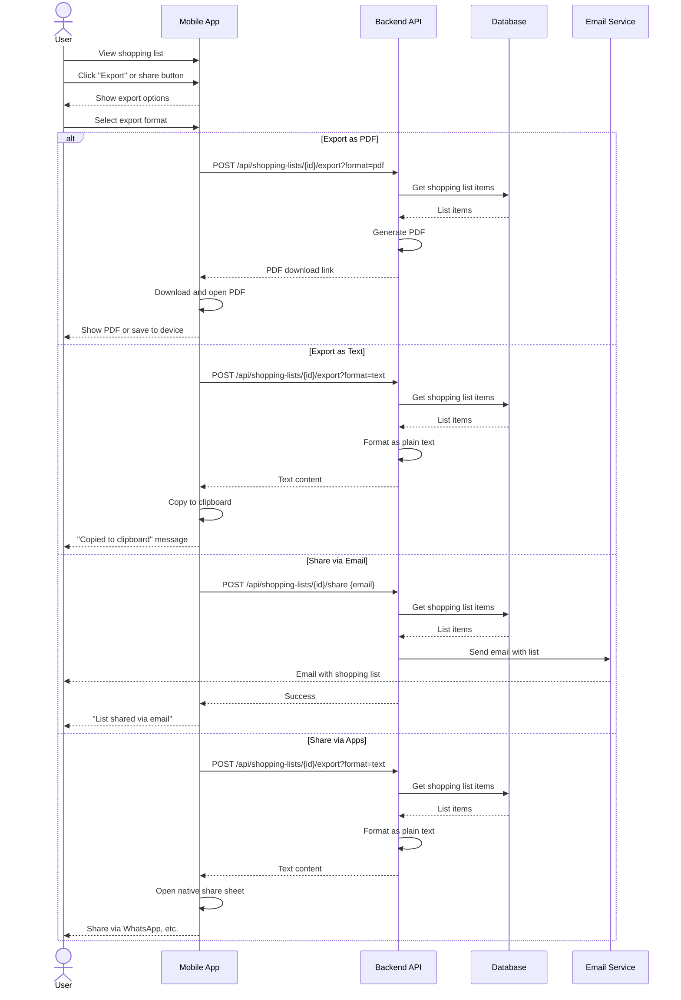
```mermaid
sequenceDiagram
    actor User
    participant App as Mobile App
    participant API as Backend API
    participant DB as Database
    participant Email as Email Service
    
    User->>App: View shopping list
    User->>App: Click "Export" or share button
    App-->>User: Show export options
    User->>App: Select export format
    
    alt Export as PDF
        App->>API: POST /api/shopping-lists/{id}/export?format=pdf
        API->>DB: Get shopping list items
        DB-->>API: List items
        API->>API: Generate PDF
        API-->>App: PDF download link
        App->>App: Download and open PDF
        App-->>User: Show PDF or save to device
        
    else Export as Text
        App->>API: POST /api/shopping-lists/{id}/export?format=text
        API->>DB: Get shopping list items
        DB-->>API: List items
        API->>API: Format as plain text
        API-->>App: Text content
        App->>App: Copy to clipboard
        App-->>User: "Copied to clipboard" message
        
    else Share via Email
        App->>API: POST /api/shopping-lists/{id}/share {email}
        API->>DB: Get shopping list items
        DB-->>API: List items
        API->>Email: Send email with list
        Email-->>User: Email with shopping list
        API-->>App: Success
        App-->>User: "List shared via email"
        
    else Share via Apps
        App->>API: POST /api/shopping-lists/{id}/export?format=text
        API->>DB: Get shopping list items
        DB-->>API: List items
        API->>API: Format as plain text
        API-->>App: Text content
        App->>App: Open native share sheet
        App-->>User: Share via WhatsApp, etc.
    end
```

## 6. Category Management Flow

### 6.1 Create Category Sequence (MVP Simplified)

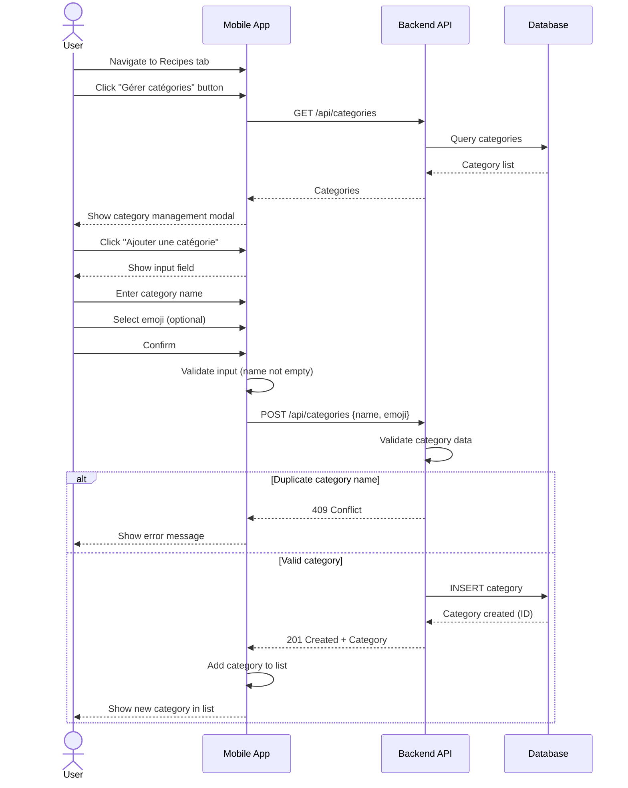
```mermaid
sequenceDiagram
    actor User
    participant App as Mobile App
    participant API as Backend API
    participant DB as Database
    
    User->>App: Navigate to Recipes tab
    User->>App: Click "Gérer catégories" button
    App->>API: GET /api/categories
    API->>DB: Query categories
    DB-->>API: Category list
    API-->>App: Categories
    App-->>User: Show category management modal
    
    User->>App: Click "Ajouter une catégorie"
    App-->>User: Show input field
    User->>App: Enter category name
    User->>App: Select emoji (optional)
    User->>App: Confirm
    
    App->>App: Validate input (name not empty)
    App->>API: POST /api/categories {name, emoji}
    API->>API: Validate category data
    
    alt Duplicate category name
        API-->>App: 409 Conflict
        App-->>User: Show error message
    else Valid category
        API->>DB: INSERT category
        DB-->>API: Category created (ID)
        API-->>App: 201 Created + Category
        App->>App: Add category to list
        App-->>User: Show new category in list
    end
```

## 7. Recipe Search Flow

### 7.1 Search Recipes Sequence (MVP Simplified)

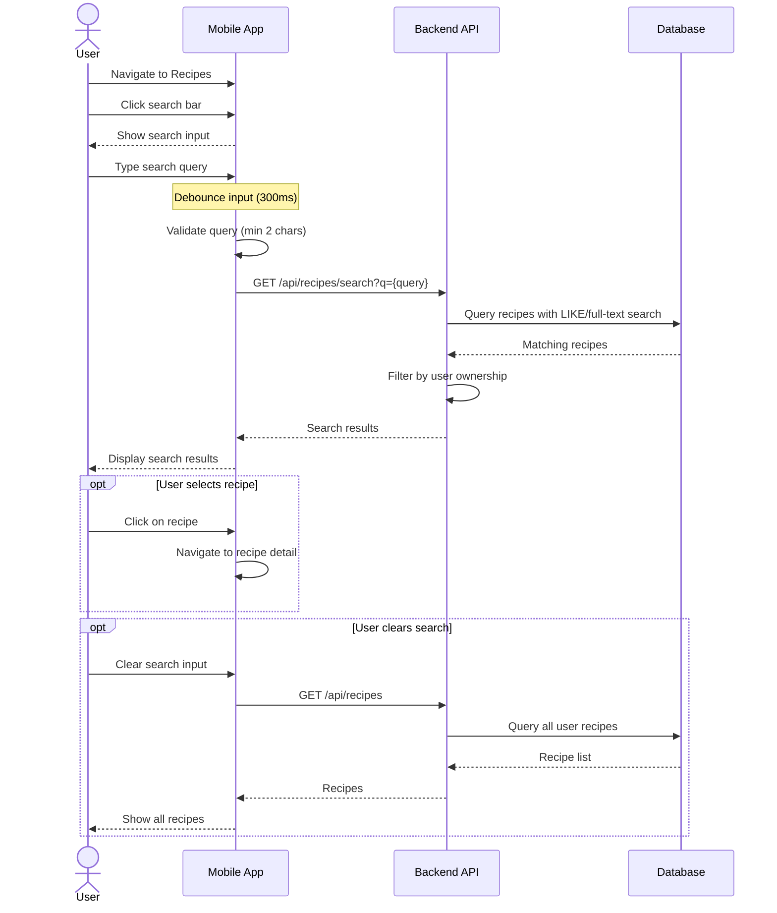
```mermaid
sequenceDiagram
    actor User
    participant App as Mobile App
    participant API as Backend API
    participant DB as Database
    
    User->>App: Navigate to Recipes
    User->>App: Click search bar
    App-->>User: Show search input
    
    User->>App: Type search query
    
    Note over App: Debounce input (300ms)
    
    App->>App: Validate query (min 2 chars)
    App->>API: GET /api/recipes/search?q={query}
    API->>DB: Query recipes with LIKE/full-text search
    DB-->>API: Matching recipes
    API->>API: Filter by user ownership
    API-->>App: Search results
    App-->>User: Display search results
    
    opt User selects recipe
        User->>App: Click on recipe
        App->>App: Navigate to recipe detail
    end
    
    opt User clears search
        User->>App: Clear search input
        App->>API: GET /api/recipes
        API->>DB: Query all user recipes
        DB-->>API: Recipe list
        API-->>App: Recipes
        App-->>User: Show all recipes
    end
```

## 8. User Registration Flow

### 8.1 User Registration Sequence (MVP Simplified)

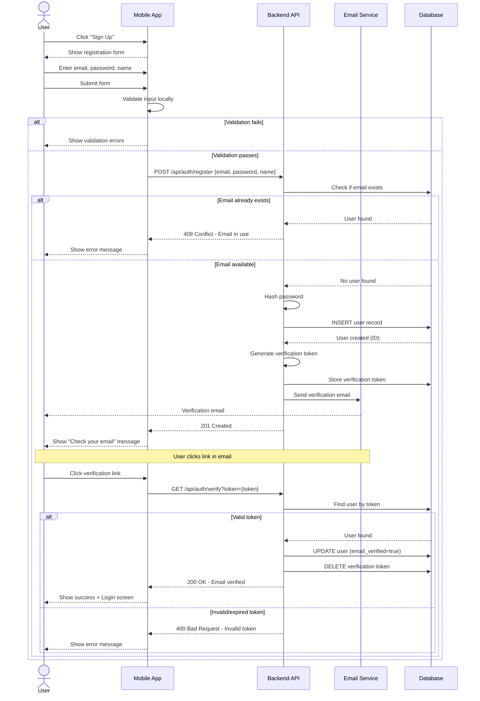
```mermaid
sequenceDiagram
    actor User
    participant App as Mobile App
    participant API as Backend API
    participant Email as Email Service
    participant DB as Database
    
    User->>App: Click "Sign Up"
    App-->>User: Show registration form
    
    User->>App: Enter email, password, name
    User->>App: Submit form
    
    App->>App: Validate input locally
    alt Validation fails
        App-->>User: Show validation errors
    else Validation passes
        App->>API: POST /api/auth/register {email, password, name}
        API->>DB: Check if email exists
        
        alt Email already exists
            DB-->>API: User found
            API-->>App: 409 Conflict - Email in use
            App-->>User: Show error message
        else Email available
            DB-->>API: No user found
            API->>API: Hash password
            API->>DB: INSERT user record
            DB-->>API: User created (ID)
            API->>API: Generate verification token
            API->>DB: Store verification token
            API->>Email: Send verification email
            Email-->>User: Verification email
            API-->>App: 201 Created
            App-->>User: Show "Check your email" message
            
            Note over User,Email: User clicks link in email
            User->>App: Click verification link
            App->>API: GET /api/auth/verify?token={token}
            API->>DB: Find user by token
            
            alt Valid token
                DB-->>API: User found
                API->>DB: UPDATE user (email_verified=true)
                API->>DB: DELETE verification token
                API-->>App: 200 OK - Email verified
                App-->>User: Show success + Login screen
            else Invalid/expired token
                API-->>App: 400 Bad Request - Invalid token
                App-->>User: Show error message
            end
        end
    end
```

## 9. Error Handling Sequence

### 9.1 Generic Error Handling Flow (MVP Simplified)

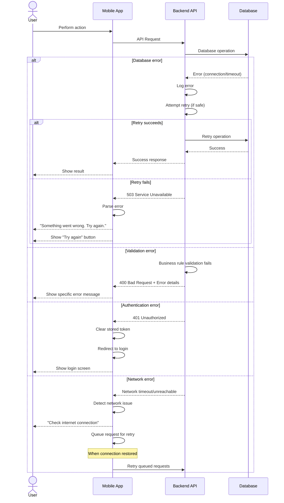
```mermaid
sequenceDiagram
    actor User
    participant App as Mobile App
    participant API as Backend API
    participant DB as Database
    
    User->>App: Perform action
    App->>API: API Request
    API->>DB: Database operation
    
    alt Database error
        DB-->>API: Error (connection/timeout)
        API->>API: Log error
        API->>API: Attempt retry (if safe)
        
        alt Retry succeeds
            API->>DB: Retry operation
            DB-->>API: Success
            API-->>App: Success response
            App-->>User: Show result
        else Retry fails
            API-->>App: 503 Service Unavailable
            App->>App: Parse error
            App-->>User: "Something went wrong. Try again."
            App-->>User: Show "Try again" button
        end
        
    else Validation error
        API->>API: Business rule validation fails
        API-->>App: 400 Bad Request + Error details
        App-->>User: Show specific error message
        
    else Authentication error
        API-->>App: 401 Unauthorized
        App->>App: Clear stored token
        App->>App: Redirect to login
        App-->>User: Show login screen
        
    else Network error
        API-->>App: Network timeout/unreachable
        App->>App: Detect network issue
        App-->>User: "Check internet connection"
        App->>App: Queue request for retry
        
        Note over App: When connection restored
        App->>API: Retry queued requests
    end
```

## 10. Offline Mode Sequence (Optional - Phase 3)

> **Note**: Offline mode is a Phase 3 enhancement. MVP can work fully online only.

### 10.1 View Recipe Offline

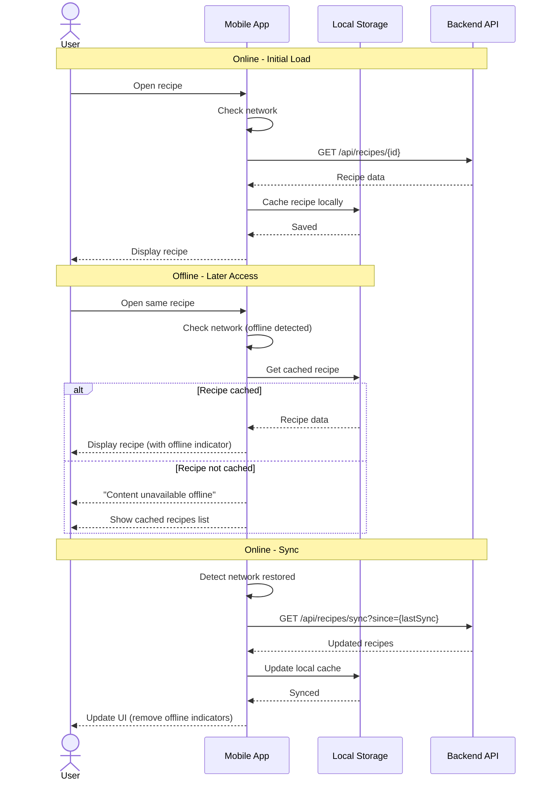
```mermaid
sequenceDiagram
    actor User
    participant App as Mobile App
    participant LocalDB as Local Storage
    participant API as Backend API
    
    Note over User,API: Online - Initial Load
    User->>App: Open recipe
    App->>App: Check network
    App->>API: GET /api/recipes/{id}
    API-->>App: Recipe data
    App->>LocalDB: Cache recipe locally
    LocalDB-->>App: Saved
    App-->>User: Display recipe
    
    Note over User,LocalDB: Offline - Later Access
    User->>App: Open same recipe
    App->>App: Check network (offline detected)
    App->>LocalDB: Get cached recipe
    
    alt Recipe cached
        LocalDB-->>App: Recipe data
        App-->>User: Display recipe (with offline indicator)
    else Recipe not cached
        App-->>User: "Content unavailable offline"
        App-->>User: Show cached recipes list
    end
    
    Note over User,API: Online - Sync
    App->>App: Detect network restored
    App->>API: GET /api/recipes/sync?since={lastSync}
    API-->>App: Updated recipes
    App->>LocalDB: Update local cache
    LocalDB-->>App: Synced
    App-->>User: Update UI (remove offline indicators)
```

---

## Summary

These sequence diagrams cover the main user flows in your Recipe and Shopping Organizer application. 

**For MVP (Phase 1)**, focus on the simplified versions showing direct interactions between:
- Mobile App
- Backend API
- PostgreSQL Database  
- Image Storage

**For Phase 2**, refer to the Video Import section when you're ready to add AI features.

**For Phase 3**, complex versions with Gateway, Cache, and service layers are available for reference when scaling is needed.

**Keep it simple, build it working, then add complexity only when necessary.**
