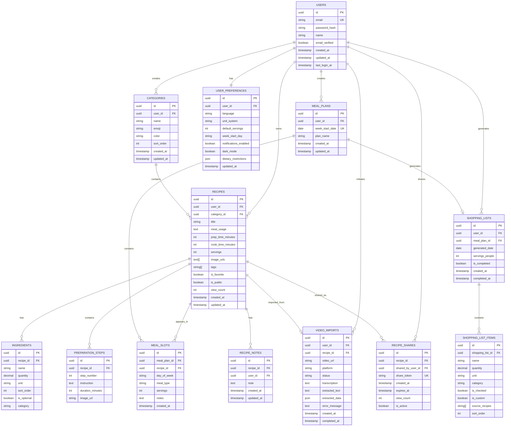

# Database Schema and ERD

## 1. Entity Relationship Diagram

### 1.1 Complete ERD



## 2. Table Definitions

### 2.1 USERS Table

```sql
CREATE TABLE users (
    id UUID PRIMARY KEY DEFAULT gen_random_uuid(),
    email VARCHAR(255) NOT NULL UNIQUE,
    password_hash VARCHAR(255) NOT NULL,
    name VARCHAR(255) NOT NULL,
    email_verified BOOLEAN DEFAULT FALSE,
    created_at TIMESTAMP WITH TIME ZONE DEFAULT CURRENT_TIMESTAMP,
    updated_at TIMESTAMP WITH TIME ZONE DEFAULT CURRENT_TIMESTAMP,
    last_login_at TIMESTAMP WITH TIME ZONE,
    CONSTRAINT email_format CHECK (email ~* '^[A-Za-z0-9._%+-]+@[A-Za-z0-9.-]+\.[A-Za-z]{2,}$')
);

CREATE INDEX idx_users_email ON users(email);
CREATE INDEX idx_users_created_at ON users(created_at);
```

**Description**: Stores user account information and authentication credentials.

**Key Columns**:
- `id`: Primary key, unique identifier for each user
- `email`: User's email address, used for login (unique)
- `password_hash`: Hashed password using bcrypt or Argon2
- `email_verified`: Whether user has verified their email
- `last_login_at`: Track user activity

### 2.2 USER_PREFERENCES Table

```sql
CREATE TABLE user_preferences (
    id UUID PRIMARY KEY DEFAULT gen_random_uuid(),
    user_id UUID NOT NULL REFERENCES users(id) ON DELETE CASCADE,
    language VARCHAR(10) DEFAULT 'fr',
    unit_system VARCHAR(20) DEFAULT 'metric',
    default_servings INT DEFAULT 4,
    week_start_day VARCHAR(10) DEFAULT 'monday',
    notifications_enabled BOOLEAN DEFAULT TRUE,
    dark_mode BOOLEAN DEFAULT FALSE,
    dietary_restrictions JSONB DEFAULT '[]',
    updated_at TIMESTAMP WITH TIME ZONE DEFAULT CURRENT_TIMESTAMP,
    CONSTRAINT unit_system_check CHECK (unit_system IN ('metric', 'imperial')),
    CONSTRAINT week_start_check CHECK (week_start_day IN ('monday', 'sunday', 'saturday'))
);

CREATE UNIQUE INDEX idx_user_preferences_user_id ON user_preferences(user_id);
```

**Description**: Stores user-specific preferences and settings.

**Key Columns**:
- `language`: Preferred language (e.g., 'en', 'fr')
- `unit_system`: Measurement system preference
- `dietary_restrictions`: JSON array of dietary restrictions/allergies

### 2.3 CATEGORIES Table

```sql
CREATE TABLE categories (
    id UUID PRIMARY KEY DEFAULT gen_random_uuid(),
    user_id UUID NOT NULL REFERENCES users(id) ON DELETE CASCADE,
    name VARCHAR(100) NOT NULL,
    emoji VARCHAR(10),
    color VARCHAR(7),
    sort_order INT DEFAULT 0,
    created_at TIMESTAMP WITH TIME ZONE DEFAULT CURRENT_TIMESTAMP,
    updated_at TIMESTAMP WITH TIME ZONE DEFAULT CURRENT_TIMESTAMP,
    CONSTRAINT unique_category_name_per_user UNIQUE(user_id, name)
);

CREATE INDEX idx_categories_user_id ON categories(user_id);
CREATE INDEX idx_categories_sort_order ON categories(user_id, sort_order);
```

**Description**: User-defined recipe categories.

**Key Columns**:
- `name`: Category name (e.g., "Plats", "Desserts")
- `emoji`: Visual icon for category
- `sort_order`: Display order in UI

### 2.4 RECIPES Table

```sql
CREATE TABLE recipes (
    id UUID PRIMARY KEY DEFAULT gen_random_uuid(),
    user_id UUID NOT NULL REFERENCES users(id) ON DELETE CASCADE,
    category_id UUID REFERENCES categories(id) ON DELETE SET NULL,
    title VARCHAR(255) NOT NULL,
    meal_usage TEXT,
    prep_time_minutes INT,
    cook_time_minutes INT,
    servings INT NOT NULL DEFAULT 4,
    image_urls TEXT[],
    tags TEXT[],
    is_favorite BOOLEAN DEFAULT FALSE,
    is_public BOOLEAN DEFAULT FALSE,
    view_count INT DEFAULT 0,
    created_at TIMESTAMP WITH TIME ZONE DEFAULT CURRENT_TIMESTAMP,
    updated_at TIMESTAMP WITH TIME ZONE DEFAULT CURRENT_TIMESTAMP,
    CONSTRAINT servings_positive CHECK (servings > 0),
    CONSTRAINT prep_time_positive CHECK (prep_time_minutes >= 0),
    CONSTRAINT cook_time_positive CHECK (cook_time_minutes >= 0)
);

CREATE INDEX idx_recipes_user_id ON recipes(user_id);
CREATE INDEX idx_recipes_category_id ON recipes(category_id);
CREATE INDEX idx_recipes_created_at ON recipes(user_id, created_at DESC);
CREATE INDEX idx_recipes_title ON recipes(user_id, title);
CREATE INDEX idx_recipes_favorite ON recipes(user_id, is_favorite) WHERE is_favorite = TRUE;
CREATE INDEX idx_recipes_tags ON recipes USING GIN(tags);
CREATE INDEX idx_recipes_public ON recipes(is_public) WHERE is_public = TRUE;

-- Full-text search index
CREATE INDEX idx_recipes_search ON recipes USING GIN(to_tsvector('french', title || ' ' || COALESCE(meal_usage, '')));
```

**Description**: Core recipe information.

**Key Columns**:
- `title`: Recipe name
- `meal_usage`: Optional description of when to use recipe
- `image_urls`: Array of image URLs
- `tags`: Array of searchable tags
- `is_favorite`: Quick access flag
- `is_public`: Whether recipe is shared publicly

### 2.5 INGREDIENTS Table

```sql
CREATE TABLE ingredients (
    id UUID PRIMARY KEY DEFAULT gen_random_uuid(),
    recipe_id UUID NOT NULL REFERENCES recipes(id) ON DELETE CASCADE,
    name VARCHAR(255) NOT NULL,
    quantity DECIMAL(10, 2),
    unit VARCHAR(50),
    sort_order INT DEFAULT 0,
    is_optional BOOLEAN DEFAULT FALSE,
    category VARCHAR(100),
    CONSTRAINT quantity_positive CHECK (quantity IS NULL OR quantity >= 0)
);

CREATE INDEX idx_ingredients_recipe_id ON ingredients(recipe_id);
CREATE INDEX idx_ingredients_name ON ingredients(name);
CREATE INDEX idx_ingredients_category ON ingredients(category);
```

**Description**: Recipe ingredients with quantities.

**Key Columns**:
- `quantity`: Amount (nullable for items like "to taste")
- `unit`: Measurement unit (g, kg, cup, tbsp, etc.)
- `category`: Ingredient category for shopping list grouping
- `sort_order`: Display order in recipe

### 2.6 PREPARATION_STEPS Table

```sql
CREATE TABLE preparation_steps (
    id UUID PRIMARY KEY DEFAULT gen_random_uuid(),
    recipe_id UUID NOT NULL REFERENCES recipes(id) ON DELETE CASCADE,
    step_number INT NOT NULL,
    instruction TEXT NOT NULL,
    duration_minutes INT,
    image_url TEXT,
    CONSTRAINT step_number_positive CHECK (step_number > 0),
    CONSTRAINT duration_positive CHECK (duration_minutes IS NULL OR duration_minutes >= 0),
    UNIQUE(recipe_id, step_number)
);

CREATE INDEX idx_prep_steps_recipe_id ON preparation_steps(recipe_id, step_number);
```

**Description**: Step-by-step recipe instructions.

**Key Columns**:
- `step_number`: Sequential order of steps
- `instruction`: Detailed step instruction
- `duration_minutes`: Optional time for this specific step

### 2.7 MEAL_PLANS Table

```sql
CREATE TABLE meal_plans (
    id UUID PRIMARY KEY DEFAULT gen_random_uuid(),
    user_id UUID NOT NULL REFERENCES users(id) ON DELETE CASCADE,
    week_start_date DATE NOT NULL,
    plan_name VARCHAR(255),
    created_at TIMESTAMP WITH TIME ZONE DEFAULT CURRENT_TIMESTAMP,
    updated_at TIMESTAMP WITH TIME ZONE DEFAULT CURRENT_TIMESTAMP,
    CONSTRAINT unique_week_per_user UNIQUE(user_id, week_start_date)
);

CREATE INDEX idx_meal_plans_user_id ON meal_plans(user_id);
CREATE INDEX idx_meal_plans_week_start ON meal_plans(user_id, week_start_date DESC);
```

**Description**: Weekly meal plans.

**Key Columns**:
- `week_start_date`: Monday (or configured start) of the week
- `plan_name`: Optional name for saved templates

### 2.8 MEAL_SLOTS Table

```sql
CREATE TABLE meal_slots (
    id UUID PRIMARY KEY DEFAULT gen_random_uuid(),
    meal_plan_id UUID NOT NULL REFERENCES meal_plans(id) ON DELETE CASCADE,
    recipe_id UUID NOT NULL REFERENCES recipes(id) ON DELETE CASCADE,
    day_of_week VARCHAR(10) NOT NULL,
    meal_type VARCHAR(20) NOT NULL,
    servings INT,
    notes TEXT,
    created_at TIMESTAMP WITH TIME ZONE DEFAULT CURRENT_TIMESTAMP,
    CONSTRAINT day_of_week_check CHECK (day_of_week IN ('monday', 'tuesday', 'wednesday', 'thursday', 'friday', 'saturday', 'sunday')),
    CONSTRAINT meal_type_check CHECK (meal_type IN ('breakfast', 'lunch', 'dinner', 'snack'))
);

CREATE INDEX idx_meal_slots_plan_id ON meal_slots(meal_plan_id);
CREATE INDEX idx_meal_slots_recipe_id ON meal_slots(recipe_id);
CREATE INDEX idx_meal_slots_day_meal ON meal_slots(meal_plan_id, day_of_week, meal_type);
```

**Description**: Individual meal assignments in meal plans.

**Key Columns**:
- `day_of_week`: Day of the week
- `meal_type`: Type of meal (breakfast, lunch, dinner, snack)
- `servings`: Override default servings for this meal

### 2.9 SHOPPING_LISTS Table

```sql
CREATE TABLE shopping_lists (
    id UUID PRIMARY KEY DEFAULT gen_random_uuid(),
    user_id UUID NOT NULL REFERENCES users(id) ON DELETE CASCADE,
    meal_plan_id UUID REFERENCES meal_plans(id) ON DELETE SET NULL,
    generated_date DATE NOT NULL DEFAULT CURRENT_DATE,
    servings_people INT NOT NULL DEFAULT 4,
    is_completed BOOLEAN DEFAULT FALSE,
    created_at TIMESTAMP WITH TIME ZONE DEFAULT CURRENT_TIMESTAMP,
    completed_at TIMESTAMP WITH TIME ZONE,
    CONSTRAINT servings_positive CHECK (servings_people > 0)
);

CREATE INDEX idx_shopping_lists_user_id ON shopping_lists(user_id);
CREATE INDEX idx_shopping_lists_meal_plan ON shopping_lists(meal_plan_id);
CREATE INDEX idx_shopping_lists_date ON shopping_lists(user_id, generated_date DESC);
```

**Description**: Generated shopping lists.

**Key Columns**:
- `meal_plan_id`: Source meal plan (nullable for manual lists)
- `servings_people`: Number of people to shop for
- `is_completed`: Whether shopping is finished

### 2.10 SHOPPING_LIST_ITEMS Table

```sql
CREATE TABLE shopping_list_items (
    id UUID PRIMARY KEY DEFAULT gen_random_uuid(),
    shopping_list_id UUID NOT NULL REFERENCES shopping_lists(id) ON DELETE CASCADE,
    name VARCHAR(255) NOT NULL,
    quantity DECIMAL(10, 2),
    unit VARCHAR(50),
    category VARCHAR(100),
    is_checked BOOLEAN DEFAULT FALSE,
    is_custom BOOLEAN DEFAULT FALSE,
    source_recipes TEXT[],
    sort_order INT DEFAULT 0,
    CONSTRAINT quantity_positive CHECK (quantity IS NULL OR quantity >= 0)
);

CREATE INDEX idx_shopping_items_list_id ON shopping_list_items(shopping_list_id);
CREATE INDEX idx_shopping_items_category ON shopping_list_items(shopping_list_id, category, sort_order);
CREATE INDEX idx_shopping_items_checked ON shopping_list_items(shopping_list_id, is_checked);
```

**Description**: Individual items in shopping lists.

**Key Columns**:
- `is_custom`: Whether manually added by user
- `source_recipes`: Array of recipe titles requiring this ingredient
- `category`: Grocery aisle/category for grouping

### 2.11 VIDEO_IMPORTS Table

```sql
CREATE TABLE video_imports (
    id UUID PRIMARY KEY DEFAULT gen_random_uuid(),
    user_id UUID NOT NULL REFERENCES users(id) ON DELETE CASCADE,
    recipe_id UUID REFERENCES recipes(id) ON DELETE SET NULL,
    video_url TEXT NOT NULL,
    platform VARCHAR(50) NOT NULL,
    status VARCHAR(20) NOT NULL DEFAULT 'pending',
    transcription TEXT,
    extracted_text TEXT,
    extracted_data JSONB,
    error_message TEXT,
    created_at TIMESTAMP WITH TIME ZONE DEFAULT CURRENT_TIMESTAMP,
    completed_at TIMESTAMP WITH TIME ZONE,
    CONSTRAINT status_check CHECK (status IN ('pending', 'processing', 'completed', 'failed')),
    CONSTRAINT platform_check CHECK (platform IN ('tiktok', 'instagram', 'youtube', 'facebook'))
);

CREATE INDEX idx_video_imports_user_id ON video_imports(user_id);
CREATE INDEX idx_video_imports_status ON video_imports(user_id, status);
CREATE INDEX idx_video_imports_created_at ON video_imports(user_id, created_at DESC);
```

**Description**: Tracks video recipe import requests and results.

**Key Columns**:
- `status`: Import status (pending, processing, completed, failed)
- `extracted_data`: JSON containing parsed recipe data
- `error_message`: Error details if import failed

### 2.12 RECIPE_SHARES Table

```sql
CREATE TABLE recipe_shares (
    id UUID PRIMARY KEY DEFAULT gen_random_uuid(),
    recipe_id UUID NOT NULL REFERENCES recipes(id) ON DELETE CASCADE,
    shared_by_user_id UUID NOT NULL REFERENCES users(id) ON DELETE CASCADE,
    share_token VARCHAR(64) NOT NULL UNIQUE,
    created_at TIMESTAMP WITH TIME ZONE DEFAULT CURRENT_TIMESTAMP,
    expires_at TIMESTAMP WITH TIME ZONE,
    view_count INT DEFAULT 0,
    is_active BOOLEAN DEFAULT TRUE
);

CREATE INDEX idx_recipe_shares_recipe_id ON recipe_shares(recipe_id);
CREATE INDEX idx_recipe_shares_user_id ON recipe_shares(shared_by_user_id);
CREATE INDEX idx_recipe_shares_token ON recipe_shares(share_token) WHERE is_active = TRUE;
```

**Description**: Recipe sharing links and analytics.

**Key Columns**:
- `share_token`: Unique token for public sharing URL
- `expires_at`: Optional expiration date
- `view_count`: Number of times shared recipe was viewed

### 2.13 RECIPE_NOTES Table

```sql
CREATE TABLE recipe_notes (
    id UUID PRIMARY KEY DEFAULT gen_random_uuid(),
    recipe_id UUID NOT NULL REFERENCES recipes(id) ON DELETE CASCADE,
    user_id UUID NOT NULL REFERENCES users(id) ON DELETE CASCADE,
    note TEXT NOT NULL,
    created_at TIMESTAMP WITH TIME ZONE DEFAULT CURRENT_TIMESTAMP,
    updated_at TIMESTAMP WITH TIME ZONE DEFAULT CURRENT_TIMESTAMP,
    CONSTRAINT unique_user_recipe_note UNIQUE(recipe_id, user_id)
);

CREATE INDEX idx_recipe_notes_recipe_id ON recipe_notes(recipe_id);
CREATE INDEX idx_recipe_notes_user_id ON recipe_notes(user_id);
```

**Description**: Personal notes users add to recipes.

## 3. Additional Database Objects

### 3.1 Triggers

```sql
-- Automatic timestamp updates
CREATE OR REPLACE FUNCTION update_updated_at_column()
RETURNS TRIGGER AS $$
BEGIN
    NEW.updated_at = CURRENT_TIMESTAMP;
    RETURN NEW;
END;
$$ language 'plpgsql';

CREATE TRIGGER update_users_updated_at BEFORE UPDATE ON users
    FOR EACH ROW EXECUTE FUNCTION update_updated_at_column();

CREATE TRIGGER update_recipes_updated_at BEFORE UPDATE ON recipes
    FOR EACH ROW EXECUTE FUNCTION update_updated_at_column();

CREATE TRIGGER update_categories_updated_at BEFORE UPDATE ON categories
    FOR EACH ROW EXECUTE FUNCTION update_updated_at_column();

CREATE TRIGGER update_meal_plans_updated_at BEFORE UPDATE ON meal_plans
    FOR EACH ROW EXECUTE FUNCTION update_updated_at_column();

CREATE TRIGGER update_recipe_notes_updated_at BEFORE UPDATE ON recipe_notes
    FOR EACH ROW EXECUTE FUNCTION update_updated_at_column();

-- Recipe view counter trigger
CREATE OR REPLACE FUNCTION increment_recipe_views()
RETURNS TRIGGER AS $$
BEGIN
    UPDATE recipes SET view_count = view_count + 1 WHERE id = NEW.recipe_id;
    RETURN NEW;
END;
$$ language 'plpgsql';

-- Note: This would be called from application logic, not a table trigger
```

### 3.2 Views

```sql
-- View for recipe with aggregated data
CREATE VIEW recipe_details AS
SELECT 
    r.id,
    r.user_id,
    r.category_id,
    r.title,
    r.meal_usage,
    r.prep_time_minutes,
    r.cook_time_minutes,
    r.servings,
    r.image_urls,
    r.tags,
    r.is_favorite,
    r.is_public,
    r.view_count,
    r.created_at,
    r.updated_at,
    c.name as category_name,
    c.emoji as category_emoji,
    COUNT(DISTINCT i.id) as ingredient_count,
    COUNT(DISTINCT ps.id) as step_count,
    u.name as author_name
FROM recipes r
LEFT JOIN categories c ON r.category_id = c.id
LEFT JOIN ingredients i ON r.id = i.recipe_id
LEFT JOIN preparation_steps ps ON r.id = ps.recipe_id
LEFT JOIN users u ON r.user_id = u.id
GROUP BY r.id, c.id, u.id;

-- View for weekly meal plan summary
CREATE VIEW meal_plan_summary AS
SELECT 
    mp.id as meal_plan_id,
    mp.user_id,
    mp.week_start_date,
    mp.plan_name,
    COUNT(DISTINCT ms.id) as meal_count,
    COUNT(DISTINCT ms.recipe_id) as unique_recipe_count,
    ARRAY_AGG(DISTINCT ms.day_of_week) as days_with_meals
FROM meal_plans mp
LEFT JOIN meal_slots ms ON mp.id = ms.meal_plan_id
GROUP BY mp.id;
```

### 3.3 Functions

```sql
-- Function to scale recipe ingredients
CREATE OR REPLACE FUNCTION scale_recipe_ingredients(
    p_recipe_id UUID,
    p_new_servings INT
)
RETURNS TABLE (
    ingredient_name VARCHAR,
    scaled_quantity DECIMAL,
    unit VARCHAR
) AS $$
DECLARE
    v_original_servings INT;
    v_scale_factor DECIMAL;
BEGIN
    -- Get original servings
    SELECT servings INTO v_original_servings
    FROM recipes WHERE id = p_recipe_id;
    
    -- Calculate scale factor
    v_scale_factor := p_new_servings::DECIMAL / v_original_servings::DECIMAL;
    
    -- Return scaled ingredients
    RETURN QUERY
    SELECT 
        i.name,
        ROUND(i.quantity * v_scale_factor, 2) as scaled_quantity,
        i.unit
    FROM ingredients i
    WHERE i.recipe_id = p_recipe_id
    ORDER BY i.sort_order;
END;
$$ LANGUAGE plpgsql;

-- Function to aggregate shopping list items
CREATE OR REPLACE FUNCTION aggregate_shopping_items(
    p_meal_plan_id UUID,
    p_servings INT
)
RETURNS TABLE (
    item_name VARCHAR,
    total_quantity DECIMAL,
    unit VARCHAR,
    category VARCHAR,
    recipes TEXT[]
) AS $$
BEGIN
    RETURN QUERY
    WITH meal_recipes AS (
        SELECT DISTINCT ms.recipe_id, r.servings as recipe_servings
        FROM meal_slots ms
        JOIN recipes r ON ms.recipe_id = r.id
        WHERE ms.meal_plan_id = p_meal_plan_id
    ),
    scaled_ingredients AS (
        SELECT 
            i.name,
            i.quantity * (p_servings::DECIMAL / mr.recipe_servings::DECIMAL) as scaled_quantity,
            i.unit,
            i.category,
            r.title as recipe_title
        FROM ingredients i
        JOIN meal_recipes mr ON i.recipe_id = mr.recipe_id
        JOIN recipes r ON i.recipe_id = r.id
    )
    SELECT 
        si.name,
        SUM(si.scaled_quantity) as total_quantity,
        si.unit,
        COALESCE(si.category, 'Other') as category,
        ARRAY_AGG(DISTINCT si.recipe_title) as recipes
    FROM scaled_ingredients si
    GROUP BY si.name, si.unit, si.category
    ORDER BY category, si.name;
END;
$$ LANGUAGE plpgsql;
```

## 4. Database Indexes Strategy

### 4.1 Primary Indexes
- All primary keys (UUIDs) are automatically indexed
- Foreign keys have indexes for join performance
- Unique constraints create implicit indexes

### 4.2 Query Optimization Indexes
- **User recipes**: `idx_recipes_user_id` for filtering recipes by user
- **Category browsing**: `idx_recipes_category_id` for category views
- **Recent recipes**: `idx_recipes_created_at` for sorting by date
- **Search**: Full-text search index on recipe titles and descriptions
- **Favorites**: Partial index for quick access to favorite recipes
- **Tags**: GIN index for array-based tag searching

### 4.3 Performance Considerations
- Use connection pooling to manage database connections
- Implement read replicas for read-heavy operations
- Use materialized views for complex aggregations
- Regular VACUUM and ANALYZE for PostgreSQL maintenance

## 5. Data Retention and Archival

### 5.1 Soft Deletes
- Implement soft delete for recipes (add `deleted_at` column)
- Keep deleted recipes for 30 days before permanent removal
- Allow users to restore deleted recipes within grace period

### 5.2 Archival Strategy
- Archive old meal plans after 1 year
- Keep shopping list history for 6 months
- Archive completed video imports after 90 days

## 6. Database Choice Considerations

### 6.1 Relational Databases (Recommended)
**PostgreSQL** (Preferred)
- ✅ Strong JSONB support for flexible data (extracted_data, dietary_restrictions)
- ✅ Full-text search capabilities
- ✅ Array data types for tags, images
- ✅ Strong data integrity with foreign keys
- ✅ Good performance for complex queries
- ✅ Excellent community and tooling

**MySQL/MariaDB** (Alternative)
- ✅ Wide hosting support
- ✅ Good performance
- ⚠️ Limited JSON support compared to PostgreSQL
- ⚠️ Less robust full-text search

### 6.2 NoSQL Options (Not Recommended for Primary DB)
**MongoDB**
- ✅ Flexible schema
- ❌ Complex relational queries more difficult
- ❌ Data integrity requires application-level enforcement
- ⚠️ Use case: Media metadata storage, cache

**Firebase Firestore**
- ✅ Real-time updates
- ✅ Easy mobile integration
- ❌ Limited query capabilities
- ❌ Expensive at scale
- ⚠️ Use case: Prototyping, small-scale apps

## 7. Backup and Recovery

### 7.1 Backup Strategy
- **Daily automated backups** of full database
- **Point-in-time recovery** enabled
- **Backup retention**: 30 days
- **Test restores** monthly

### 7.2 Disaster Recovery
- Database replication to multiple availability zones
- Automated failover to standby replica
- Recovery Time Objective (RTO): 1 hour
- Recovery Point Objective (RPO): 5 minutes

## 8. Security Considerations

### 8.1 Data Protection
- Encrypt sensitive data at rest
- Use parameterized queries to prevent SQL injection
- Hash passwords with bcrypt (work factor 12+)
- Implement row-level security for multi-tenancy

### 8.2 Access Control
- Use principle of least privilege for database users
- Application user has limited permissions (no DDL)
- Admin user for migrations and maintenance only
- Separate read-only user for reporting/analytics

This database schema provides a solid foundation for your Recipe and Shopping Organizer application, with room for growth and optimization as needs evolve.
